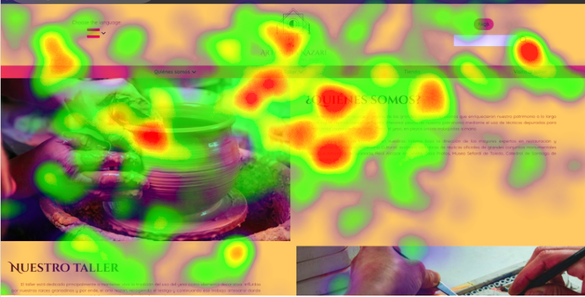
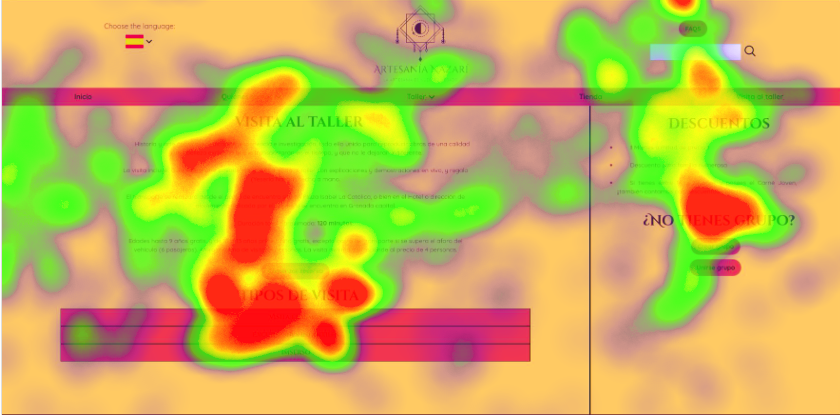
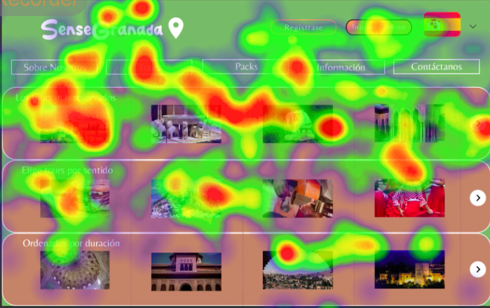
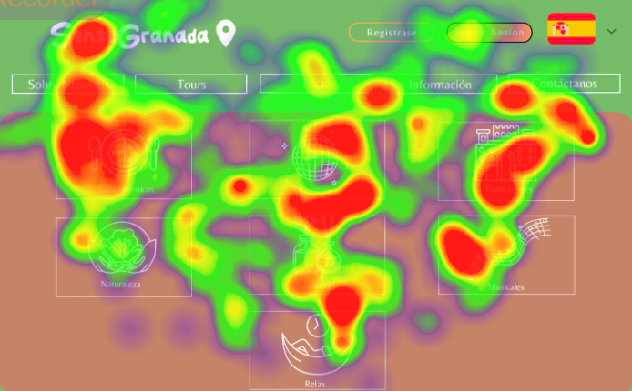
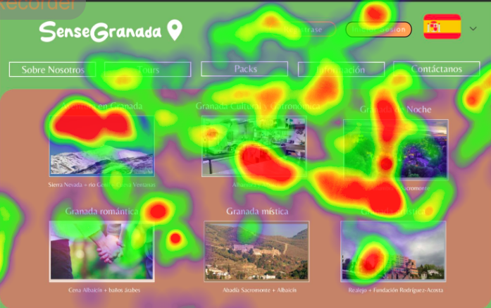
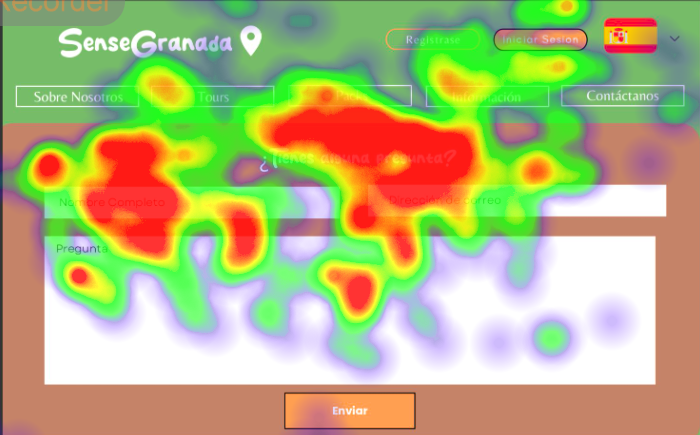
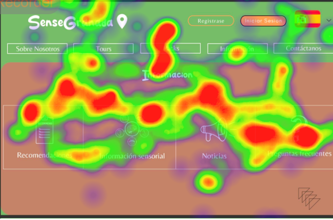
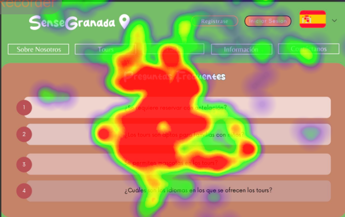
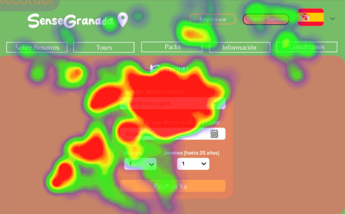

**PŔACTICA 5 DIU** 

**1. Diseño del experimento**

Para realizar este experimento hemos utilizado Gaze Recorder. Nos hemos creado una cuenta y hemos subido las imágenes tanto de la página que nos ha tocado analizar (Artesanía Nazarí - ElMedusa) como la nuestra (SenseGranada). 

 

Para comenzar, hemos decidido qué instrucciones vamos a darle al usuario:

- Hemos explicado la temática de ambas páginas: la primera es sobre artesanía nazarí donde puedes reservar visitas a talleres y la segunda sobre tours en Granada que ofrece la posibilidad de reservar distintos tours.

- Hemos dicho que se fijen en cómo reservarían una visita/tour en cada una de las páginas.

De esta manera hemos comprobado la facilidad que tiene el usuario para utilizar ambas páginas y cuáles son sus puntos fuertes, es decir, aquellas zonas que llaman más la atención del usuario.

**2. Reclutamiento de usuarios**

Para esta parte de la práctica a parte de realizar nosotros mismos el eyetracking (ya que en el guión se pedía que a parte de mostrarle la página a usuarios objetivos también tenía  que ser visualizada por un experto) y le hemos pedido a 4 compañeros de clase que visualizasen ambas páginas. Hemos hecho uso de la aplicación mencionada anteriormente, para comprobar la usabilidad de la web. Para realizar las pruebas hemos usado este enlace: https://gazerecorder.com/

| Usuario | Género | Edad | Característica Principal |
|---------|--------|------|-------------------------|
| Sergio  | Hombre | 20   | Detallista               |
| Maria   | Mujer  | 20   | Creativa                 |
| Gádor   | Mujer  | 20   | Organizada               |
| Victor  | Hombre | 20   | Analítico                |
| Alba    | Mujer  | 20   | Empática                 |
| Denis   | Hombre | 20   | Innovador                |

**3. Análisis de datos**

Artesanía Nazarí

> Inicio
> 
>

>Visita al taller
>
> 

	
**SenseGranada**

>Inicio
>
>

>Tours
>
>

>Sobre Nosotros
>
>

>Packs
>
>

>Preguntas
>
>

>Información
>
>

>Preguntas frecuentes
>
>

>Reservar tour
>
>

4. Conclusión

Como podemos observar, destacan las secciones como quienes somos, nuestro taller y visita al taller con respecto a la página de la Artesanía Nazarí y reservar tours, packs y sobre nosotros con respecto a la página de SenseGranada.

En resumen, tras haber realizado estos tests (tanto expertos como personas objetivas) podemos ver que ambas páginas se encuentran bien diseñadas ya que captan la atención de los visitantes aquellas zonas en las que el diseñador ha querido poner énfasis como la reserva de talleres/tours, imágenes de la galería o  información relevante.

